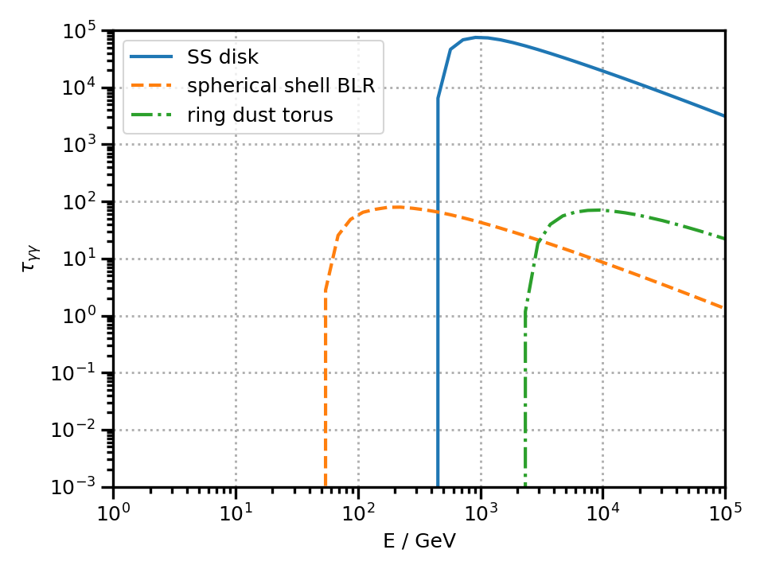

.. _absorption:

Absorption by :math:`\gamma`-:math:`\gamma` pair production
===========================================================
The photon fields that represent the targets for the Compton scattering might re-asbsorb
the scattered photons via :math:`\gamma`-:math:`\gamma` pair production. 
In the same way, on their path towards Earth, the highest-energy photons might be absorbed
by the extragalactic background light (EBL).     
`agnpy` computes the optical depth (or opacity) :math:`\tau_{\gamma \gamma}` as a function of the frequency :math:`\nu` 
produced by the target photon fields and by the EBL. 
Photoabsorption results in an attenuation of the flux by a factor :math:`\exp(-\tau_{\gamma \gamma})`.

Absorption on target photon fields
----------------------------------
In the following example we compute the optical depth produced by the disk, the broad line region and the dust torus photon fileds

.. code-block:: python

	import numpy as np
	import astropy.units as u
	import astropy.constants as const
	from agnpy.emission_regions import Blob
	from agnpy.targets import SSDisk, SphericalShellBLR, RingDustTorus
	from agnpy.absorption import Absorption

	# disk parameters
	M_BH = 1.2 * 1e9 * const.M_sun.cgs
	L_disk = 2 * 1e46 * u.Unit("erg s-1")
	eta = 1 / 12
	R_in = 6 
	R_out = 200 
	disk = SSDisk(M_BH, L_disk, eta, R_in, R_out, R_g_units=True)

	# blr definition
	csi_line = 0.024
	R_line = 1.1e17 * u.cm
	blr = SphericalShellBLR(L_disk, csi_line, "Lyalpha", R_line)

	# dust torus definition
	T_dt = 1e3 * u.K
	csi_dt = 0.1
	dt = RingDustTorus(L_disk, csi_dt, T_dt)

The :class:`~agnpy.absorption.Absorption` requires as input the type of target, :class:`~agnpy.targets`, 
the distance between the blob and the target photon field (:math:`r`) and (optionally) the redshift of 
the source to correct the observed energies and the cosine of the angle between the jet axis and the observer
:math:`\mu_s`

.. code-block:: python

	# consider the 3C 454.3 example of Finke 2016
	z = 0.859 
	# consider a fixed distance of the blob from the target fields
	r = 1.1e16 * u.cm

	# we assume mu_s=1
	absorption_disk = Absorption(disk, r=r, z=z)
	absorption_blr = Absorption(blr, r=r, z=z)
	absorption_dt = Absorption(dt, r=r, z=z)

	E = np.logspace(0, 5) * u.GeV
	nu = E.to("Hz", equivalencies=u.spectral())

	tau_disk = absorption_disk.tau(nu)
	tau_blr = absorption_blr.tau(nu)
	tau_dt = absorption_dt.tau(nu)

	# plot the absorption
	import matplotlib.pyplot as plt
	from agnpy.utils.plot import load_mpl_rc
	# matplotlib adjustments
	load_mpl_rc()

	fig, ax = plt.subplots()
	ax.loglog(E, tau_disk, lw=2, ls="-", label = "SS disk")
	ax.loglog(E, tau_blr, lw=2, ls="--", label = "spherical shell BLR")
	ax.loglog(E, tau_dt, lw=2, ls="-.", label = "ring dust torus")
	ax.legend()
	ax.set_xlabel("E / GeV")
	ax.set_ylabel(r"$\tau_{\gamma \gamma}$")
	ax.set_xlim([1, 1e5])
	ax.set_ylim([1e-3, 1e5])
	plt.show()

Extragalactic Background Light
------------------------------
The absorption produced by the EBL models of [Franceschini2008]_, [Finke2010]_ and [Dominguez2011]_, 
tabulated as a function of redshift and energy, is available in `data/ebl_models`. 
The absorption values are interpolated by `agnpy` and can be later evaluated for a given redshift and range of frequencies.

.. plot:: snippets/ebl_models.py
    :include-source:

API
---

.. automodule:: agnpy.absorption
   :noindex:
   :members: Absorption, EBL