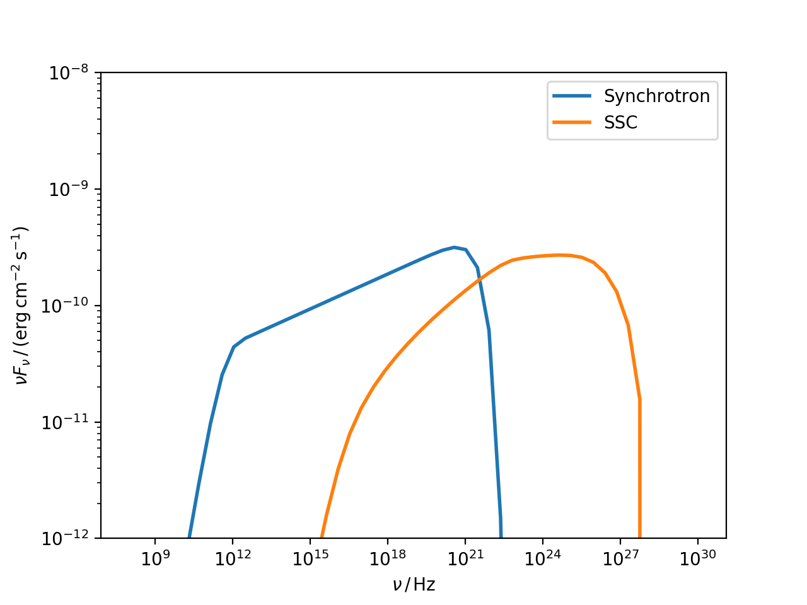
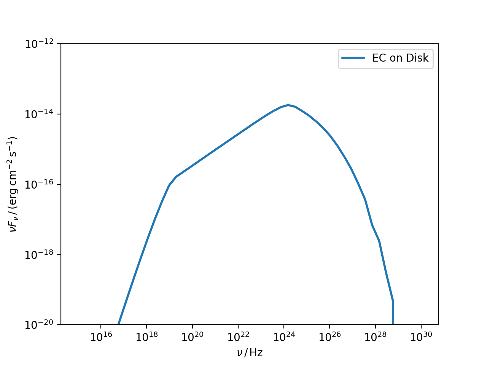

.. _compton:

Inverse Compton
===============

Two different Compton processes are considered:

* Synchrotron Self Compton (SSC), implemented in the class :class:`~agnpy.compton.SynchrotronSelfCompton`, foreseeing as target for the inverse Compton the synchrotron photons produced in the blob by the accelerated electrons (based on [DermerMenon2009]_ and [Finke2008]_);

* External Compton (EC), implemented in the class :class:`~agnpy.compton.ExternalCompton`, foreseeing as a target for the inverse Compton the (direct and reprocessed) photon fields generated by the accretion phenomena (based on [Dermer2009]_ and [Finke2016]_).

Synchrotron Self-Compton
------------------------
Let us keep expanding the example in :ref:`synchrotron` to compute the SSC radiation.
Again let us define the blob

.. code-block:: python

	import numpy as np
	import astropy.units as u
	from astropy.coordinates import Distance
	from agnpy.emission_regions import Blob
	from agnpy.synchrotron import Synchrotron
	from agnpy.compton import SynchrotronSelfCompton
	import matplotlib.pyplot as plt

	# set the spectrum normalisation (total energy in electrons in this case)
	spectrum_norm = 1e48 * u.Unit("erg") 
	# define the spectral function through a dictionary
	spectrum_dict = {
		"type": "PowerLaw", 
		"parameters": {"p": 2.8, "gamma_min": 1e2, "gamma_max": 1e7}
	}
	R_b = 1e16 * u.cm
	B = 1 * u.G
	z = Distance(1e27, unit=u.cm).z
	delta_D = 10
	Gamma = 10
	blob = Blob(R_b, z, delta_D, Gamma, B, spectrum_norm, spectrum_dict)

and the synchrotron radiation produced by it

.. code-block:: python

	synch = Synchrotron(blob)
	

the SSC radiation can be computed passing to the :class:`~agnpy.compton.SynchrotronSelfCompton` class the :class:`~agnpy.emission_regions.Blob` and :class:`~agnpy.synchrotron.Synchrotron` instances

.. code-block:: python
	
	ssc = SynchrotronSelfCompton(blob, synch)

we can now plot the complete SED

.. code-block:: python
	
	nu = np.logspace(8, 30) * u.Hz
	# let us compute the SED values at these frequencies 
	synch_sed = synch.sed_flux(nu)
	ssc_sed = ssc.sed_flux(nu)
	plt.loglog(nu, synch_sed, lw=2, label="Synchrotron")
	plt.loglog(nu, ssc_sed, lw=2, label="SSC")
	plt.xlabel(r"$\nu\,/\,\mathrm{Hz}$")
	plt.ylabel(r"$\nu F_{\nu}\,/\,(\mathrm{erg}\,\mathrm{cm}^{-2}\,\mathrm{s}^{-1})$")
	plt.ylim([1e-12, 1e-8])
	plt.legend()
	plt.show()

External Compton
----------------

As an example of this process let us consider Compton scattering of the photon field produced by the disk by a borken power-law electron distribution.

.. code-block:: python

	import numpy as np
	import astropy.units as u
	import astropy.constants as const
	from astropy.coordinates import Distance
	from agnpy.emission_regions import Blob
	from agnpy.targets import SSDisk
	from agnpy.compton import ExternalCompton
	import matplotlib.pyplot as plt

	spectrum_norm = 6e42 * u.erg
	parameters = {
		"p1": 2.1,
		"p2": 3.5,
		"gamma_b": 1e4,
		"gamma_min": 20,
		"gamma_max": 5e7,
	}
	spectrum_dict = {"type": "BrokenPowerLaw", "parameters": parameters}
	R_b = 1e16 * u.cm
	B = 0.56 * u.G
	z = 1
	delta_D = 40
	Gamma = 40
	blob = Blob(R_b, z, delta_D, Gamma, B, spectrum_norm, spectrum_dict)
	
let us define the target disk

.. code-block:: python

	# disk parameters
	M_BH = 1.2 * 1e9 * const.M_sun
	R_g = ((const.G * M_BH) / (const.c * const.c)).cgs
	L_disk = 2 * 1e46 * u.Unit("erg s-1")
	eta = 1 / 12
	R_in = 6 * R_g
	R_out = 200 * R_g
	disk = SSDisk(M_BH, L_disk, eta, R_in, R_out)

the EC radiation can be computed passing to the :class:`~agnpy.compton.ExternalCompton` class the :class:`~agnpy.emission_regions.Blob` and :class:`~agnpy.targets.SSDisk` instances. Remember also to set the distance between the blob and the target photon field (`r`)

.. code-block:: python
	
	ec = ExternalCompton(blob, disk, r=1e17 * u.cm)
   
let us plot the resulting SED:

.. code-block:: python

	nu = np.logspace(15, 30) * u.Hz
	ec_disk_sed = ec.sed_flux(nu)
	plt.loglog(nu, ec_disk_sed, lw=2, label="EC on Disk")
	plt.xlabel(r"$\nu\,/\,\mathrm{Hz}$")
	plt.ylabel(r"$\nu F_{\nu}\,/\,(\mathrm{erg}\,\mathrm{cm}^{-2}\,\mathrm{s}^{-1})$")
	plt.ylim([1e-20, 1e-12])
	plt.legend()
	plt.show()

For more examples of External Compton radiation check the `tutorial <../tutorials/external_compton.ipynb>`_.

API
---

.. automodule:: agnpy.compton
   :noindex:
   :members: SynchrotronSelfCompton, ExternalCompton 