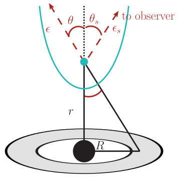
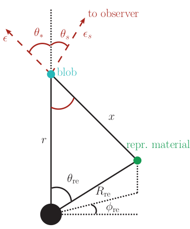

.. _derivations:

=======================================================================================================
Calculations of Energy Densities, Inverse Compton SEDs and :math:`\gamma`-:math:`\gamma` optical depths
=======================================================================================================
In this section I collect the formulas that are implemented in the :py:mod:`~agnpy.targets`, 
:py:mod:`~agnpy.compton` and :py:mod:`~agnpy.absorption` modules to compute the energy densities (:math:`u`) of the
target photon fields, the SEDs (:math:`\nu F_{\nu}`) generated by their Inverse Compton scattering and their optical 
depths for the :math:`\gamma`-:math:`\gamma` pair-production.    
As most of these formulas are not explicited in the references we use, I reworked
most of the calculations myself. I leave most of the math explicit hoping it would be
easier or interesting for the interested readers to check or rework themselves.

Energy densities :math:`u`
==========================
The integrated energy densities :math:`u\,[\uunits]` for the different photon 
fields are computed both in a stationary reference frame whose 
origin coincides with the galaxy Black Hole and in a reference frame comoving 
with the Blob, which is streaming along the jet with velocity :math:`\Beta` and 
Lorentz factor :math:`\Gamma`.   

Notation
--------
Differential quantities are implicit, i.e. 

.. math::
    X(x_1, x_2; y) = \frac{\partial X}{\partial x_1 \, \partial x_2}(y),

where after the ; we specify parameters. We aim to calculate the integral energy 
density, of a given photon field, i.e. 

.. math::
    u(r) = \int\diff\epsilon \int\diff\Omega \, u(\epsilon, \Omega; r),

where
:math:`u(\epsilon, \Omega; r) =  \frac{\partial u}{\partial \epsilon  \, \partial \Omega}(r)`
is the differential energy density, :math:`\epsilon = E / (m_e c^2)` is the dimensionless 
energy of the photon (in units of the electron rest mass), :math:`\Omega = (\mu, \phi)` 
is the solid angle and :math:`r` specifies the distance of the blob along the jet axis. 

Transformations
---------------
Quantities specified in the Blob comoving frame are primed. We recall the following 
energy and cosine transformations, from the stationary 
to the comoving frame

.. math::
    \epsilon' &= \Gamma \epsilon (1 - \Beta \mu), \\
    \mu' &= \frac{\mu - \Beta}{1 - \Beta \mu};
    :label: boost_stat_to_com

and viceversa from the comoving to the stationary frame

.. math::
    \epsilon &= \Gamma \epsilon' (1 + \Beta \mu'), \\
    \mu &= \frac{\mu' + \Beta}{1 + \Beta \mu'}.
    :label: boost_com_to_stat

It can be proved [Dermer2002]_ that the quantity :math:`u(\epsilon, \Omega)/\epsilon^3` 
is a relativistic invariant, from which it follows

.. math::
    u'(\epsilon', \Omega') = \frac{u(\epsilon, \Omega)}{\utransform}.
    :label: u_stat_to_com

Isotropic Monochromatic
-----------------------
Let us consider an isotropic monochromatic (:math:`\epsilon_0`) radiation field with 
energy density :math:`u_0\,/\,\uunits`,

.. math::
    u(\epsilon, \Omega) = \frac{u_0\,\delta(\epsilon - \epsilon_0)}{4 \pi}
    :label: u_iso

**Galaxy Frame**

.. math::
    u = \int_{0}^{\infty}\diff\epsilon \,
        \int_{0}^{2\pi}\diff\phi \,
        \int_{-1}^{1}\diff\mu \, u(\epsilon, \Omega) = u_0. 

**Comoving Frame**

.. math::
    u' &= \int_{0}^{\infty}\diff\epsilon' \,
            \int_{0}^{2\pi}\diff\phi' \,
            \int_{-1}^{1}\diff\mu' \, 
            \frac{u_0\,\delta(\epsilon - \epsilon_0)}{4 \pi} \,
            \frac{1}{\utransform} \\
        &= 2\pi \int_{0}^{\infty} \frac{\diff \epsilon}{\Gamma (1 + \Beta\mu')} \,
            \int_{-1}^{1}\diff\mu' \,
            \frac{u_0\,\delta(\epsilon - \epsilon_0)}{4 \pi} \,
            \frac{1}{\utransform} \\
        &= \frac{u_0}{2 \Gamma^4}\int_{-1}^{1}\diff\mu' \,
            \frac{1}{(1 + \Beta\mu')^4} 
        = \frac{u_0}{2 \Gamma^4} 
            \left[ - \frac{1}{3\Beta (1 + \Beta\mu')^3}\right]_{-1}^{1} \\
        &= \frac{u_0}{2 \Gamma^4} 
            \left[\frac{(1 + \Beta)^3 - (1 - \Beta)^3}{3 \Beta \Gamma^{-6}}\right] 
        = \boxed{u_0\,\Gamma^2 \left(1 + \frac{\Beta^2}{3}\right).}

And we have reobtained the result in Eq. 5 of [Dermer1994]_ and Eq. 10 of 
[Dermer2002]_. Note that from the first to the second line we have replaced 
:math:`\diff \epsilon'` with :math:`\diff \epsilon / (\Gamma (1 + \Beta \mu'))` 
(from Eq. :eq:`boost_stat_to_com`) in order to simplify :math:`\diff \epsilon` with the Dirac delta,
this type of simplification wil recur in the following calculations.

Monochromatic Point Source Behind the Jet
-----------------------------------------
Let us consider a source of luminosity :math:`L_0` at a distance :math:`r` from the jet,

.. math::
    u(\epsilon, \Omega; r) = \frac{L_0}{4 \pi c r^2} \frac{\delta(\mu-1)}{2 \pi} \delta(\epsilon - \epsilon_0)
    :label: u_ps_behind_jet

where we label :math:`u_0(r) = \frac{L_0}{4 \pi c r^2}` for convenience.

**Galaxy Frame**

.. math::
    u(r) = \int_{0}^{\infty}\diff\epsilon \,
           \int_{0}^{2\pi}\diff\phi \,
           \int_{-1}^{1}\diff\mu \, u_0(r) \frac{\delta(\mu-1)}{2 \pi} \delta(\epsilon - \epsilon_0) 
         = u_0(r) \left( = \frac{L_0}{4 \pi c r^2} \right), 
    :label: point_source_stat

where the normalisation :math:`2\pi` cancels out the result of the integration in 
:math:`\diff\phi` and the delta in :math:`\mu` removes the integration in :math:`\mu`.

**Comoving Frame**

.. math::    
    u'(r) = \int_{0}^{\infty}\diff\epsilon' \,
            \int_{0}^{2\pi}\diff\phi' \,
            \int_{-1}^{1}\diff\mu' \, 
            u_0(r) \frac{\delta(\mu-1)}{2 \pi} \delta(\epsilon - \epsilon_0) \,
            \frac{1}{\utransform},

Now we convert the differentials in :math:`\epsilon'` and :math:`\mu'` in :math:`\epsilon` and :math:`\mu`, 
in order to simplify them with the deltas. We note that from Eq. :eq:`boost_stat_to_com`

.. math::
    \frac{\diff\mu'}{\diff\mu} = \frac{(1 - \Beta\mu) + (\mu - \Beta)\Beta}{(1 - \Beta\mu)^2} 
    \Rightarrow \diff\mu' = \frac{1}{\Gamma^2 (1 - \Beta\mu)^2} \diff\mu,

therefore

.. math::
    u'(r) &= 2\pi \int_{0}^{\infty} \frac{\diff \epsilon}{\Gamma (1 + \Beta\mu')} \,
             \int_{-1}^{1}\frac{\diff\mu}{\Gamma^2 (1 - \Beta\mu)^2} \,
             \frac{u_0(r)}{2\pi} \delta(\epsilon - \epsilon_0) \delta(\mu - 1) \,
             \frac{1}{\utransform} \\
          &= \frac{u_0(r)}{\Gamma^6} \int_{-1}^{1} \frac{\diff\mu}{(1 - \Beta\mu)^2(1 + \Beta\mu')^4} \,
             \delta(\mu - 1) \\
          &= \frac{u_0(r)}{\Gamma^6} \frac{1}{(1 - \Beta)^2(1 + \Beta)^4} 
           = \boxed{\frac{u_0(r)}{\Gamma^2 (1 + \Beta)^2}.}   
    :label: point_source_com

In the penultimate equality we have used :math:`\mu = 1 \Rightarrow \mu'=1` 
from Eq. :eq:`boost_stat_to_com` and the condition imposed by the dirac delta.
We have reobtained Eq. 6 of [Dermer1994]_.

**NOTE** we will use Eq. :eq:`point_source_stat` and :eq:`point_source_com` 
as a crosscheck for the radiation fields of more complicate objects 
(for distances much larger than their dimensions they should appear as a point 
source behind the jet).

Shakura Sunyaev Disk
--------------------

.. _compton_disk:

The differential energy density for a geometrically thin optically thick Shakura 
Sunyaev accretion disk reads

.. math::
    u(\epsilon, \Omega; r) = \frac{3}{(4 \pi)^2 c} 
    \frac{G M \dot{m}}{R^3 \mu}
    \varphi(R) \, \delta(\epsilon - \epsilon_0(R))
    :label: u_ss_disk

from Eq. 25 in [Dermer2002]_. :math:`\varphi(R)` represents the variation of 
radiant surface energy flux along the radius

.. math::
    \varphi(R) = 1 - \sqrt{\frac{R_{\rm in}}{R}}
    :label: phi_R
    
and :math:`\epsilon_0(R)` the monochromatic approximation for the photon energy 
emitted from the disk at radius :math:`R`

.. math::
    \epsilon_0(R) = 2.7 \times 10^{-4} \left(\frac{l_{\rm Edd}}{M_8 \eta}\right)^{1/4} 
    \left(\frac{R}{R_g}\right)^{-3/4}.
    :label: epsilon_R

In the above equations :math:`M` is the mass of the Black Hole (:math:`M_8` the 
same quantity expressed in :math:`10^8\,M_{\odot}` units), :math:`\dot{m}` is the 
BH mass accretion rate, :math:`\eta` the fraction of gravitational energy converted 
to radiant energy, :math:`l_{\rm Edd}` the fraction of the disk luminosity to the 
Eddington luminosity, :math:`R_g` the gravitational radius. The geometry of the 
problem is illustrated in :numref:`compton_disk` (in our equations :math:`\mu=\cos\theta`). 
Notice that

.. math::
    R = r \sqrt{\mu^{-2} - 1}
    :label: R_from_mu_r

and the maximum and minimum cosine angles under which the disk is viewed at the 
distance :math:`r`, are

.. math::
    \mu_{\rm min} &= \frac{1}{\sqrt{1 + \frac{R^2_{\rm out}}{r^2}}}, \\ 
    \mu_{\rm max} &= \frac{1}{\sqrt{1 + \frac{R^2_{\rm in}}{r^2}}}

where :math:`R_{\rm in}` and :math:`R_{\rm out}` are inner and outer radiuses of 
the disk, respectively. Note that given Eq. :eq:`R_from_mu_r` we can write 
Eq. :eq:`phi_R` and :eq:`epsilon_R` as :math:`\varphi(\mu; r)` and 
:math:`\epsilon_0(\mu; r)`.

**Galaxy Frame**

.. math::
    u(r) &= \int_{0}^{\infty}\diff\epsilon \,
            \int_{0}^{2\pi}\diff\phi \,
            \int_{\mu_{\rm min}}^{\mu_{\rm max}}\diff\mu \,
            \frac{3}{(4 \pi)^2 c} 
            \frac{G M \dot{m}}{R^3 \mu}
            \varphi(R) \, \delta(\epsilon - \epsilon_0(R)) \\
         &= \boxed{\frac{3}{8 \pi c} \frac{G M \dot{m}}{r^3} 
            \int_{\mu_{\rm min}}^{\mu_{\rm max}}\diff\mu \,
            \frac{\varphi(\mu; r)}{\mu(\mu^{-2} - 1)^{3/2}}.}
    :label: ssdisk_stat

**Comoving Frame**

.. math::
    u'(r) &= \int_{0}^{\infty}\diff\epsilon' \,
             \int_{0}^{2\pi}\diff\phi' \,
             \int_{\mu'_{\rm min}}^{\mu'_{\rm max}}\diff\mu' \, 
             \frac{3}{(4 \pi)^2 c} 
             \frac{G M \dot{m}}{R^3 \mu}
             \varphi(R)
             \delta(\epsilon - \epsilon_0(R))
             \frac{1}{\utransform} \\
          &= \frac{3}{8 \pi c} \frac{G M \dot{m}}{r^3}
             \int_{0}^{\infty}\frac{\diff \epsilon}{\Gamma (1 + \Beta\mu')} \,
             \int_{\mu_{\rm min}}^{\mu_{\rm max}}\frac{\diff\mu}{\Gamma^2 (1 - \Beta\mu)^2} \,
             \frac{\varphi(\mu; r)}{\mu(\mu^{-2} - 1)^{-3/2}}
             \frac{\delta(\epsilon - \epsilon_0(\mu, r))}{\utransform} \\
          &= \boxed{\frac{3}{8 \pi c} \frac{G M \dot{m}}{r^3}
             \int_{\mu_{\rm min}}^{\mu_{\rm max}}\diff\mu \,
             \frac{\varphi(\mu; r)}{\Gamma^6 (1 - \Beta\mu)^2 (1 + \Beta \mu')^4 \mu(\mu^{-2} - 1)^{-3/2}}.}
    :label: ssdisk_com

Both these equations cannot be simplified analytically, we can check numerically
- through the functions implemented in `agnpy` - if their limit for large values of 
:math:`r` reduces to the case of point source behind the jet, i.e. Eq. 
:eq:`point_source_stat` and :eq:`point_source_com`.
Check the `tutorial notebook on energy densities <tutorials/energy_densities.html>`_.

Spherical Shell Broad Line Region
---------------------------------

.. _compton_reprocessed:

Let us consider the BLR as a monochromatic (:math:`\epsilon_{\rm li}`) infinitesimally 
thin (:math:`R_{\rm li}`) shell, as in [Finke2016]_

.. math::
    u(\epsilon, \Omega; r) = \frac{\xi_{\rm li} L_{\rm disk}}{(4\pi)^2c} 
    \delta(\epsilon - \epsilon_{\rm li}) 
    \int_{-1}^{1}\frac{\diff\mu_{\rm re}}{x^2} \delta(\mu - \mu_*),
    :label: u_blr
    
where :math:`\xi_{\rm li}` is the fraction fo the disk radiation recprocessed by 
the BLR and

.. math::        
        \mu_*^2 &= 1 - \left( \frac{R_{\rm li}}{x} \right)^2 (1 - \mu_{\rm re}^2), \\
            x^2 &= R_{\rm li}^2 + r^2 - 2 r  R_{\rm li} \mu_{\rm re},
        :label: reprocessed_geom

the geometry of the problem with reprocessing material is illustrated in 
:numref:`compton_reprocessed` (in our equations :math:`\mu=\cos\theta`, 
:math:`\mu_* = \cos\theta_*`, :math:`\mu_{\rm re} = \cos \theta_{\rm re}` and we have replaced 
the radius of the reprocessing material with the one of the BLR :math:`R_{\rm li}`).

**Galaxy Frame**

.. math::
    u(r) &= \int_{0}^{\infty}\diff\epsilon \,
            \int_{0}^{2\pi}\diff\phi \,
            \int_{-1}^{1}\diff\mu \,
            \frac{\xi_{\rm li} L_{\rm disk}}{(4\pi)^2c} 
            \delta(\epsilon - \epsilon_{\rm li}) 
            \int_{-1}^{1}\frac{\diff\mu_{\rm re}}{x^2} \delta(\mu - \mu_*) \\
        &= \boxed{\frac{\xi_{\rm li} L_{\rm disk}}{8 \pi c} \int_{-1}^{1}\frac{\diff\mu_{\rm re}}{x^2}.}
    :label: blr_stat

Let us examine if for large distances (:math:`r \gg R_{\rm li}`) Eq. :eq:`blr_stat` 
:math:`\rightarrow` Eq. :eq:`point_source_stat`, i.e. if the BLR appears as a point 
source behind the jet. Since :math:`x \xrightarrow[r \gg R_{\rm li}]{} r`, we have

.. math::
    u(r) = \frac{\xi_{\rm li} L_{\rm disk}}{8 \pi c} \int_{-1}^{1}\frac{\diff\mu_{\rm re}}{r^2} 
         = \frac{\xi_{\rm li} L_{\rm disk}}{4 \pi c r^2},

which is Eq. :eq:`point_source_stat`, i.e. the energy density of a monochromatic 
point source behind the jet with :math:`L_0 = \xi_{\rm li} L_{\rm disk}`.

**Comoving Frame**

.. math::
    u'(r) &= \int_{0}^{\infty}\diff\epsilon' \,
             \int_{0}^{2\pi}\diff\phi' \,
             \int_{-1}^{1}\diff\mu' \, 
             \frac{\xi_{\rm li} L_{\rm disk}}{(4\pi)^2c} 
             \delta(\epsilon - \epsilon_{\rm li}) 
             \int_{-1}^{1}\frac{\diff\mu_{\rm re}}{x^2}
             \frac{\delta(\mu - \mu_*)}{\utransform} \\
         &= 2\pi \int_{0}^{\infty} \frac{\diff \epsilon}{\Gamma (1 + \Beta\mu')} \,
             \int_{-1}^{1}\frac{\diff\mu}{\Gamma^2 (1 - \Beta\mu)^2} \,
             \frac{\xi_{\rm li} L_{\rm disk}}{(4\pi)^2c} 
             \delta(\epsilon - \epsilon_{\rm li}) 
             \int_{-1}^{1}\frac{\diff\mu_{\rm re}}{x^2}  
             \frac{\delta(\mu - \mu_*)}{\utransform} \\
          &= \frac{\xi_{\rm li} L_{\rm disk}}{8 \pi c}
             \int_{-1}^{1} \frac{\diff\mu}{\Gamma^2 (1 - \Beta\mu)^2 \Gamma^4 (1 + \Beta\mu')^4}
             \int_{-1}^{1}\frac{\diff\mu_{\rm re}}{x^2} \delta(\mu - \mu_*), 

using the delta condition :math:`\mu = \mu_* \Rightarrow \mu' = \frac{\mu_* - \Beta}{1 - \Beta \mu_*}`.
The latter in turns imply :math:`1 + \Beta\mu' = \frac{1}{\Gamma^2 (1 - \Beta\mu_*)}`, 
therefore

.. math::        
    u'(r) &= \frac{\xi_{\rm li} L_{\rm disk}}{8 \pi c}
             \int_{-1}^{1} \frac{\Gamma^8 (1 - \Beta\mu_*)^4}{\Gamma^6 (1 - \Beta\mu_*)^2} 
             \frac{\diff\mu_{\rm re}}{x^2} \\
          &= \boxed{\frac{\xi_{\rm li} L_{\rm disk}}{8 \pi c}
             \Gamma^2 \int_{-1}^{1} (1 - \Beta\mu_*)^2
             \frac{\diff\mu_{\rm re}}{x^2}.}
    :label: blr_com

If the calculation was done correctly, in the limit of large distances (:math:`r \gg R_{\rm li}`)
Eq. :eq:`blr_com` :math:`\rightarrow` Eq. :eq:`point_source_com`, i.e. the BLR 
should appear as a point source behind the jet (also in the comoving frame).
For :math:`r \gg R_{\rm li}`, :math:`x^2 \rightarrow r^2` and 
:math:`\mu_* \rightarrow 1`, so

.. math::
    u'(r) = \Gamma^2 (1 - \Beta)^2 \frac{\xi_{\rm li} L_{\rm disk}}{8 \pi c}
            \frac{2}{r^2} = \frac{\Gamma^2 (1 - \Beta^2)^2}{(1 + \Beta)^2} 
            \frac{\xi_{\rm li} L_{\rm disk}}{4 \pi c r^2} 
          = \frac{1}{\Gamma^2 (1 + \Beta)^2} 
            \frac{\xi_{\rm li} L_{\rm disk}}{4 \pi c r^2}.

where in the penultimate equality we have multiplied and divided by :math:`(1 + \Beta)^2`.
We have reobtained Eq. :eq:`point_source_com` with :math:`L_0 = \xi_{\rm li} L_{\rm disk}`.

Ring Dust Torus
---------------

Following [Finke2016]_, let us approximate the torus with a infinitesimally thin
ring of radius :math:`R_{\rm dt}`, whose Black Body radiation peaks at the dimensionless 
energy :math:`\epsilon_{\rm dt}`

.. math::
    u(\epsilon, \Omega; r) = \frac{\xi_{\rm dt} L_{\rm disk}}{8 \pi^2 c x^2} 
    \delta(\mu - r/x) \delta(\epsilon - 2.7 \Theta),
    :label: u_dt

:math:`\xi_{\rm dt}` is the fraction fo the disk radiation recprocessed by 
the Dust Torus. 

Note the formula has a factor 2 with respect to Eq. 91 in the paper.
The factor 2 correction should actually be applied to the emissivity in Eq. 90, 
that is in turn used to compute :math:`u`. The distance of the blob from the reprocessing material is simply 

.. math::
    x^2 = R_{\rm dt}^2 + r^2.

**Galaxy Frame**

.. math::
    u(r) &= \int_{0}^{\infty}\diff\epsilon \,
            \int_{0}^{2\pi}\diff\phi \,
            \int_{-1}^{1}\diff\mu \,
            \frac{\xi_{\rm dt} L_{\rm disk}}{8 \pi^2 c} 
            \delta(\mu - r/x) \delta(\epsilon - 2.7 \Theta) \\
         &= \boxed{\frac{\xi_{\rm dt} L_{\rm disk}}{4 \pi c x^2}.}
    :label: torus_stat

This can be straightforwardly reduced to Eq. :eq:`point_source_stat` for 
:math:`r \gg R_{\rm dt}` (in which case :math:`x \rightarrow r`) with :math:`L_0 = \xi_{\rm dt} L_{\rm disk}`.

**Comoving Frame**

.. math::
    u'(r) &= \int_{0}^{\infty}\diff\epsilon' \,
             \int_{0}^{2\pi}\diff\phi' \,
             \int_{-1}^{1}\diff\mu' \, 
             \frac{\xi_{\rm dt} L_{\rm disk}}{(4\pi)^2 c x^2} 
             \delta(\mu - r/x) \delta(\epsilon - 2.7 \Theta)
             \frac{1}{\utransform} \\
          &= 2\pi \int_{0}^{\infty} \frac{\diff \epsilon}{\Gamma (1 + \Beta\mu')} \,
             \int_{-1}^{1}\frac{\diff\mu}{\Gamma^2 (1 - \Beta\mu)^2} \,
             \frac{\xi_{\rm dt} L_{\rm disk}}{(4\pi)^2 c x^2} 
             \delta(\mu - r/x) \delta(\epsilon - 2.7 \Theta)
             \frac{1}{\utransform} \\
          &= \frac{\xi_{\rm dt} L_{\rm disk}}{8 \pi c x^2}
             \int_{-1}^{1} \frac{\diff\mu}{\Gamma^2 (1 - \Beta\mu)^2 \Gamma^4 (1 + \Beta\mu')^4}
             \delta(\mu - r/x), \\

as we have seen for the BLR case, using the delta condition 
:math:`\mu = r/x \Rightarrow \mu' = \frac{r/x - \Beta}{1 - \Beta r/x}` and it 
follows that :math:`1 + \Beta\mu' = \frac{1}{\Gamma^2 (1 - \Beta r/x)}`. 
Follows that

.. math::
    u'(r) = \frac{\xi_{\rm dt} L_{\rm disk}}{4 \pi c x^2}
            \frac{\Gamma^8 (1 - \Beta\,r/x)^4}{\Gamma^6 (1 - \Beta\,r/x)^2} 
          = \boxed{\Gamma^2 (1 - \Beta\,r/x)^2 \frac{\xi_{\rm dt} L_{\rm disk}}{4 \pi c x^2}.}
    :label: torus_com

In the limit of large distances :math:`r/x \rightarrow 1`, if we multiply and 
divide by :math:`(1 + \Beta)^2`, we reobtain Eq. :eq:`point_source_com`
with :math:`L_0 = \xi_{\rm dt} L_{\rm disk}`.

Spectral Energy Distributions for External Compton 
==================================================
We will use the previously listed densities :math:`u(\epsilon, \Omega; r)`
to compute the SED produced when the blob electrons Compton-scatter the target
radiation fields.

GKM Approach
------------
The approach implemented in `agnpy` follows the one proposed by Georganopolous,
Kirk and Mastichiadis, (GKM, see [DermerMenon2009]_ and references therein), i.e. 
the comoving electron distribution :math:`N'_e(\gamma, \Omega)` is transformed to 
the stationary frame, and then the external photon field is Compton-scattered.

With the aforementioned approach, the :math:`\nu F_{\nu}` flux for jet electrons
Compton-scattering external radiation fields reads

.. math::
    \nu F_{\nu}^{\rm EC}(r) = \frac{c \pi r_e^2}{4 \pi d_L^2} \epsilon_s^2 \delta_D^3
                              \int \diff\Omega \, 
                              \int_{0}^{\epsilon_{\rm high}} \diff\epsilon \, \frac{u(\epsilon, \Omega; r)}{\epsilon^2}
                              \int_{\gamma_{\rm low}}^{\infty} \diff\gamma \, \frac{N'_e(\gamma / \delta_D)}{\gamma^2}\,
                              \Xi_C           
   :label: ec_sed

(Eq. 6.97 in [DermerMenon2009]_ or Eq. 34 in [Dermer2009]_). In the previous equation
:math:`r_e` is the electron radius, :math:`d_L` the luminosity distance, 
:math:`\epsilon_s` the dimensionless energy of the scattered photon, :math:`\delta_D`
the Doppler factor of the blob. The extreme of integration on the target energy 
:math:`\epsilon_{\rm high}` and Lorentz factor of the electron :math:`\gamma_{\rm low}`
are imposed by kinematics limits:

.. math::
    \epsilon_{\rm high} &= \frac{2 \epsilon_s}{1 - \cos \psi}, \\
    \gamma_{\rm low} &= \frac{\epsilon_s}{2} 
    \left[ 1 + \sqrt{1 + \frac{2}{\epsilon \epsilon_s (1 - \cos \psi)}} \right],

with :math:`\cos\psi` being the angle between the direction of the incident photon 
and the electron

.. math::
    \cos \psi = \mu \mu_s + \sqrt{1 - \mu^2} \sqrt{1 - \mu_s^2} \cos \phi,
    :label: cos_psi

remember that in [DermerMenon2009]_ and in the other reference we rely on, the "head-on"
approximation for the Compton cross section is considered. This implies that the Compton-scattered
photons have the same direction of the scattering electrons. 
The Compton cross section is simplified in Eq. :eq:`ec_sed` to the integration 
kernel 

.. math::
    \Xi_C &= y + y^{-1} + \frac{2 \epsilon_s}{\gamma \bar{\epsilon} y} 
    + \left( \frac{\epsilon_s}{\gamma \bar{\epsilon} y} \right)^2 \\
    {\rm with}\; y &= 1 - \frac{\epsilon_s}{\gamma} \\
    {\rm and}\; \bar{\epsilon} &= \epsilon \gamma (1 - \cos\psi).
    :label: compton_kernel

Isotropic Monochromatic
-----------------------
Plugging Eq. :eq:`u_iso` in Eq. :eq:`ec_sed` 

.. math::
    \nu F_{\nu}^{\rm EC} &= \frac{3 c \sigma_T}{8} \frac{1}{4 \pi d_L^2}
                            \left( \frac{\epsilon_s}{\epsilon_0} \right)^2 \delta_D^3
                            \frac{u_0}{4 \pi}
                            \int_0^{2 \pi} \diff\phi \, 
                            \int_{-1}^{1} \diff\mu \, 
                            \int_{\gamma_{\rm low}}^{\infty} \diff\gamma \, 
                            \frac{N'_e(\gamma / \delta_D)}{\gamma^2}\,\Xi_C \\
                         &= \boxed{\frac{3}{2^7 \pi^2} \frac{c \sigma_T u_0}{d_L^2}  
                            \left( \frac{\epsilon_s}{\epsilon_0} \right)^2 \delta_D^3 
                            \int_0^{2 \pi} \diff\phi \, 
                            \int_{-1}^{1} \diff\mu \,
                            \int_{\gamma_{\rm low}}^{\infty} \diff\gamma \, 
                            \frac{N'_e(\gamma / \delta_D)}{\gamma^2}\,\Xi_C.}
    :label: ec_iso
                
In `agnpy` the External Compton on a monochromatic isotropic photon field is implemented 
using the Cosmic Microwave Background (CMB) as a target.

Monochromatic Point Source Behind the Jet
-----------------------------------------
Plugging Eq. :eq:`u_ps_behind_jet` in Eq. :eq:`ec_sed` 

.. math::
    \nu F_{\nu}^{\rm EC}(r) &= \frac{3 c \sigma_T}{8} \frac{1}{4 \pi d_L^2} \delta_D^3
                               \int_0^{2 \pi} \diff\phi \, 
                               \int_{-1}^{1} \diff\mu \,
                               \int_{0}^{\epsilon_{\rm high}} \diff\epsilon \,
                               \frac{L_0}{4 \pi c r^2} \frac{\delta(\mu - 1)}{2 \pi} 
                               \delta(\epsilon - \epsilon_0) \,
                               \int_{\gamma_{\rm low}}^{\infty} \diff\gamma \, \frac{N'_e(\gamma / \delta_D)}{\gamma^2}\,\Xi_C \\
                            &= \boxed{\frac{3}{2^7 \pi^2} \frac{\sigma_T L_0}{d_L^2 r^2}  
                               \left( \frac{\epsilon_s}{\epsilon_0} \right)^2 \delta_D^3 
                               \int_{\gamma_{\rm low}}^{\infty} \diff\gamma \, 
                               \frac{N'_e(\gamma / \delta_D)}{\gamma^2}\,\Xi_C.}
    :label: ec_point_source

Notice that the delta on :math:`\mu` removes also the dependency on :math:`\phi` 
as :math:`\cos \psi(\mu=1) = \mu_s` within the integration kernel.

Shakura Sunyaev Disk
--------------------
Plugging Eq. :eq:`u_ss_disk` in Eq. :eq:`ec_sed`

.. math::
    \nu F_{\nu}^{\rm EC}(r) &= \frac{3 c \sigma_T}{8} \frac{1}{4 \pi d_L^2} \epsilon_s^2 \delta_D^3
                               \int_0^{2 \pi} \diff\phi \,
                               \int_{\mu_{\rm min}}^{\mu_{\rm max}} \diff\mu \,
                               \int_{0}^{\epsilon_{\rm high}} \diff\epsilon \,
                               \frac{3}{(4 \pi)^2 c} \frac{G M \dot{m}}{R^3 \mu}
                               \varphi(\mu; r) \delta(\epsilon - \epsilon_0(\mu; r)) \frac{1}{\epsilon^2} \,
                               \int_{\gamma_{\rm low}}^{\infty} \diff\gamma \, \frac{N'_e(\gamma / \delta_D)}{\gamma^2}\,\Xi_C \\
                            &= \boxed{\frac{3^2}{2^9 \pi^3}
                               \frac{\sigma_T G M \dot{m}}{d_L^2 r^3} 
                               \epsilon_s^2 \delta_D^3
                               \int_0^{2 \pi} \diff\phi \,
                               \int_{\mu_{\rm min}}^{\mu_{\rm max}} \diff\mu \,
                               \frac{\varphi(\mu; r)}{\epsilon^2_0(\mu; r) \mu (\mu^{-2} - 1)^{3/2}}
                               \int_{\gamma_{\rm low}}^{\infty} \diff\gamma \,
                               \frac{N'_e(\gamma / \delta_D)}{\gamma^2}\,\Xi_C.} 
    :label: ec_ss_disk

Notice that now in the Compton Kernel :math:`\Xi_c` the target energy is angle 
dependent: :math:`\epsilon \rightarrow \epsilon_0(\mu; r)`. In the previous formula - as already done in the computation 
of the energy densities - we have expressed both :math:`\varphi` and :math:`\epsilon_0` as a function of the 
zenith angle (:math:`\mu`) and the height above the disk (:math:`r`), rather than simply as a function of the radial
coordinate along the disk (:math:`R`).    

Expressing the luminosity of the disk as 
:math:`L_{\rm disk} = l_{\rm Edd} L_{Edd} = \eta \dot{m} c^2` and remembering the 
expression for the gravitational radius (:math:`R_g = GM / c^2`) one can easily obtain
Eq. 70 of [Dermer2009]_ from Eq. :eq:`ec_ss_disk`.    

In the reference a factor :math:`1 / \mu` is missing in the integrand 
(compare Eq. 25 in [Dermer2002]_ with Eq. 69 in [Dermer2009]_).

Spherical Shell Broad Line Region
---------------------------------
Plugging Eq. :eq:`u_blr` in Eq. :eq:`ec_sed`

.. math::
    \nu F_{\nu}^{\rm EC}(r) &= \frac{3 c \sigma_T}{8} \frac{1}{4 \pi d_L^2} \epsilon_s^2 \delta_D^3
                               \int_0^{2 \pi} \diff\phi \, 
                               \int_{-1}^{1} \diff\mu \,
                               \int_{0}^{\epsilon_{\rm high}} \diff\epsilon \,
                               \frac{\xi_{\rm li} L_{\rm disk}}{(4\pi)^2 c} 
                               \delta(\epsilon - \epsilon_{\rm li}) 
                               \int_{-1}^{1}\frac{\diff\mu_{\rm re}}{x^2} \delta(\mu - \mu_*) \,
                               \int_{\gamma_{\rm low}}^{\infty} \diff\gamma \, \frac{N'_e(\gamma / \delta_D)}{\gamma^2}\,\Xi_C \\
                           &=  \boxed{\frac{3}{2^9 \pi^3} 
                               \frac{\sigma_T \xi_{\rm li} L_{\rm disk}}{d_L^2}
                               \left( \frac{\epsilon_s}{\epsilon_{\rm li}} \right)^2
                               \delta_D^3 
                               \int_0^{2 \pi} \diff\phi \,
                               \int_{-1}^{1}\frac{\diff\mu_{\rm re}}{x^2} 
                               \int_{\gamma_{\rm low}}^{\infty} \diff\gamma \, 
                               \frac{N'_e(\gamma / \delta_D)}{\gamma^2}\,\Xi_C.}
    :label: ec_blr

Notice this time in the Compton Kernel the target energy will be simply :math:`\epsilon_{\rm li}`
but the angle between the electron and the photon will depend on :math:`\mu_*` 
(by virtue of the delta in :math:`\mu`): 
:math:`\cos \psi = \mu_* \mu_s + \sqrt{1 - \mu_*^2} \sqrt{1 - \mu_s^2} \cos \phi,` 
with :math:`\mu_*` in turn depending on the zenith angle of the reprocessing material, :math:`\mu_{\rm re}`, according to Eq. :eq:`reprocessed_geom`.

Ring Dust Torus
---------------
Plugging Eq. :eq:`u_dt` in Eq. :eq:`ec_sed`

.. math::
    \nu F_{\nu}^{\rm EC}(r) &= \frac{3 c \sigma_T}{8} \frac{1}{4 \pi d_L^2} \epsilon_s^2 \delta_D^3
                               \int_0^{2 \pi} \diff\phi \, 
                               \int_{-1}^{1} \diff\mu \,
                               \int_{0}^{\epsilon_{\rm high}} \diff\epsilon \,
                               \frac{\xi_{\rm dt} L_{\rm disk}}{8 \pi^2 c x^2} 
                               \delta(\mu - r/x) \delta(\epsilon - 2.7 \Theta) \,
                               \int_{\gamma_{\rm low}}^{\infty} \diff\gamma \, \frac{N'_e(\gamma / \delta_D)}{\gamma^2}\,\Xi_C \\
                           &=  \boxed{\frac{3}{2^8 \pi^3} 
                               \frac{\sigma_T \xi_{\rm dt} L_{\rm disk}}{d_L^2 x^2}
                               \left( \frac{\epsilon_s}{\epsilon_{\rm dt}} \right)^2
                               \delta_D^3 
                               \int_0^{2 \pi} \diff\phi \,
                               \int_{\gamma_{\rm low}}^{\infty} \diff\gamma \, 
                               \frac{N'_e(\gamma / \delta_D)}{\gamma^2}\,\Xi_C.}
    :label: ec_dt

Notice in the Compton Kernel the target energy will be simply :math:`\epsilon_{\rm dt} = 2.7 \Theta`
and the angle between the electron and the photon :math:`\cos \psi = \mu_s r/x + \sqrt{1 - (r/x)^2} \sqrt{1 - \mu_s^2} \cos \phi`.

Optical depth for :math:`\gamma`-:math:`\gamma` pair production
===============================================================
We will use the previously listed densities :math:`u(\epsilon, \Omega; r)`
to compute their optical depth for :math:`\gamma`-:math:`\gamma` pair production.

The optical depth for :math:`\gamma`-:math:`\gamma` pair production for a target with energy density :math:`u(\epsilon, \Omega)` reads

.. math::
    \tau_{\gamma \gamma}(\nu) = \int_{r}^{\infty} \diff l \,
                                \int_{0}^{2\pi} \diff\phi \, 
                                \int_{-1}^{1}  \diff\mu \, (1 - \cos\psi) \, 
                                \int_{0}^{\infty} \diff\epsilon \,
                                \frac{u(\epsilon, \Omega; l)}{\epsilon m_e c^2} \, 
                                \sigma_{\gamma \gamma}(s)
    :label: tau

where: 
    - :math:`\cos\psi = \mu\mu_s + \sqrt{1 - \mu^2}\sqrt{1 - \mu_s^2} \cos\phi` is the cosine of the angle between the hitting and the absorbing photon;
    - :math:`u(\epsilon, \mu, \phi; l)` is the energy density of the target photon field;
    - :math:`\sigma_{\gamma \gamma}(s)` is the pair-production cross section; 
    - :math:`s = \epsilon_1 \epsilon \, (1 - \cos\psi)\,/\,2` is the kinematic variable representing the Lorentz factor of the produced :math:`e^{\pm}` pair in the center-of-momentum frame;  
    - :math:`\epsilon_1 = h \nu\,/\,(m_e c^2)` is the dimensionless energy of the photon hitting the target.

Photoabsorption results in an attenuation of the photon flux by a factor :math:`\exp(-\tau_{\gamma \gamma})`.    

Basic formulas are borrowed from [Finke2016]_. The approach presented therein (and in [Dermer2009]_) though simplifies 
the integration by assuming that the hitting photons travel in the direction parallel to the jet axis 
(:math:`\mu_s \rightarrow 1`), decoupling the cross section and the :math:`(1 - \cos\psi)` term from the integral on 
:math:`\phi`. The optical depths thus calculated are therefore valid only for blazars.    
`agnpy` carries on the full integration, such that the optical depths are valid for any jetted AGN.

Isotropic Monochromatic
-----------------------
Plugging Eq. :eq:`u_iso` in Eq. :eq:`tau`

.. math::
    \tau_{\gamma \gamma}(\nu) &= \int_{r}^{\infty} \diff l \,
                                 \int_{0}^{2\pi} \diff\phi \, 
                                 \int_{-1}^{1}  \diff\mu \, (1 - \cos\psi) \, 
                                 \int_{0}^{\infty} \diff\epsilon \,
                                 \frac{1}{\epsilon m_e c^2} 
                                 \frac{u_0\,\delta(\epsilon - \epsilon_0)}{4 \pi}
                                 \sigma_{\gamma \gamma}(s) \\
                              &= \boxed{\frac{u_0}{4 \pi \epsilon m_e c^2}
                                 \int_{r}^{\infty} \diff l \,
                                 \int_{0}^{2\pi} \diff\phi \, 
                                 \int_{-1}^{1}  \diff\mu \, (1 - \cos\psi) \, 
                                 \sigma_{\gamma \gamma}(s).}
    :label: tau_iso

In this case the kinematic variable :math:`s = \epsilon_0 \epsilon_1 (1 - \cos\psi) / 2`.

Monochromatic Point Source Behind the Jet
-----------------------------------------
Plugging Eq. :eq:`u_ps_behind_jet` in Eq. :eq:`tau`

.. math::
    \tau_{\gamma \gamma}(\nu) &= \int_{r}^{\infty} \diff l \,
                                 \int_{0}^{2\pi} \diff\phi \, 
                                 \int_{-1}^{1}  \diff\mu \, (1 - \cos\psi) \, 
                                 \int_{0}^{\infty} \diff\epsilon \,
                                 \frac{1}{\epsilon m_e c^2} 
                                 \frac{L_0}{4 \pi c l^2} \frac{\delta(\mu-1)}{2 \pi} \delta(\epsilon - \epsilon_0) \, 
                                 \sigma_{\gamma \gamma}(s) \\
                              &= \boxed{\frac{L_0}{4 \pi \epsilon_0 m_e c^3}
                                 \frac{(1 - \mu_s)}{r} \, \sigma_{\gamma \gamma}(s). }
    :label: tau_ps_behind_jet

Notice that the delta on :math:`\mu` removes also the dependency on :math:`\phi` within the cross section, as :math:`\cos \psi(\mu=1) = \mu_s`.

In this case the kinematic variable :math:`s = \epsilon_0 \epsilon_1 (1 - \mu_s) / 2`.

Shakura Sunyaev Disk
--------------------
Plugging Eq. :eq:`u_ss_disk` in Eq. :eq:`tau`

.. math::
    \tau_{\gamma \gamma}(\nu) &= \int_{r}^{\infty} \diff l \,
                                 \int_{0}^{2\pi} \diff\phi \, 
                                 \int_{\mu_{\rm min}(l)}^{\mu_{\rm max}(l)}  \diff\mu \, (1 - \cos\psi) \, 
                                 \int_{0}^{\infty} \diff\epsilon \,
                                 \frac{1}{\epsilon m_e c^2}
                                 \frac{3}{(4 \pi)^2 c} \frac{G M \dot{m}}{R^3 \mu} \varphi(\mu; l) \, \delta(\epsilon - \epsilon_0(\mu; l)) \, 
                                 \sigma_{\gamma \gamma}(s) \\     
                              &= \frac{3}{(4 \pi)^2 c} \frac{G M \dot{m}}{m_e c^2} \,
                                 \int_{r}^{\infty} \diff l \,
                                 \int_{0}^{2\pi} \diff\phi \, 
                                 \int_{\mu_{\rm min}(l)}^{\mu_{\rm max}(l)}  \diff\mu \, (1 - \cos\psi) \, 
                                 \frac{\varphi(\mu; l)}{\epsilon_0(\mu; l) \mu l^3 (\mu^{-2} - 1)^{3/2}} \,
                                 \sigma_{\gamma \gamma}(s) \\
                              &= \boxed{\frac{3}{(4 \pi)^2} \frac{L_{\rm disk}}{m_e c^3 \eta R_g} \,
                                 \int_{\rtilde}^{\infty} \diff \ltilde \,
                                 \int_{0}^{2\pi} \diff\phi \, 
                                 \int_{\mu_{\rm min}(\ltilde)}^{\mu_{\rm max}(\ltilde)}  \diff\mu \, (1 - \cos\psi) \, 
                                 \frac{\varphi(\mu; \ltilde)}{\epsilon_0(\mu; \ltilde) \mu \ltilde^3 (\mu^{-2} - 1)^{3/2}} \,
                                 \sigma_{\gamma \gamma}(s).}
    :label: tau_ss_disk 

In the previous formula - as already done in the computation of the energy densities and the EC SEDs - we have 
expressed both :math:`\varphi` and :math:`\epsilon_0` as a function of the zenith angle (:math:`\mu`) and the height 
above the disk (:math:`l`), rather than simply as a function of the radial coordinate along the disk (:math:`R`). 

Notice in the last equality we have reduced the integration over the distance (:math:`l`) to the scaled distance (:math:`\tilde{l} = l / R_g`).

Also in this case each value of :math:`l` in the outermost integral changes the extremes of integration on :math:`\mu` 
(remembering :math:`\mu_{\rm  min} = \sqrt{1 / (1 + R_{\rm out}^2/l^2)}`, :math:`\mu_{\rm  max} = \sqrt{1 / (1 + R_{\rm in}^2/l^2)}`).   

In this case the kinematic variable :math:`s = \epsilon_0(\mu; \ltilde) \epsilon_1 (1 - \cos\psi) / 2`.

Spherical Shell Broad Line Region
---------------------------------
Plugging Eq. :eq:`u_blr` in Eq. :eq:`tau`

.. math::
    \tau_{\gamma \gamma}(\nu) &= \int_{r}^{\infty} \diff l \,
                                 \int_{0}^{2\pi} \diff\phi \, 
                                 \int_{-1}^{1}  \diff\mu \, (1 - \cos\psi) \, 
                                 \int_{0}^{\infty} \diff\epsilon \,
                                 \frac{1}{\epsilon m_e c^2}
                                 \frac{\xi_{\rm li} L_{\rm disk}}{(4\pi)^2c} 
                                 \delta(\epsilon - \epsilon_{\rm li}) 
                                 \int_{-1}^{1}\frac{\diff\mu_{\rm re}}{x^2} \delta(\mu - \mu_*) \,
                                 \sigma_{\gamma \gamma}(s) \\     
                              &= \boxed{\frac{1}{(4 \pi)^2} \frac{\xi_{\rm li} L_{\rm disk}}{\epsilon_{\rm li} m_e c^3} \,
                                 \int_{r}^{\infty} \diff l \,
                                 \int_{0}^{2\pi} \diff\phi \,
                                 \int_{-1}^{1}\frac{\diff\mu_{\rm re}}{x^2} \, (1 - \mu_*) \,
                                 \sigma_{\gamma \gamma}(s) .} 

Given the delta in :math:`\mu` the angle between the photons is :math:`\cos \psi = \mu_* \mu_s + \sqrt{1 - \mu_*^2} \sqrt{1 - \mu_s^2} \cos \phi`
with :math:`\mu_*` in turn depending on the zenith angle of the reprocessing material, :math:`\mu_{\rm re}`, according to Eq. :eq:`reprocessed_geom`.

In this case the kinematic variable :math:`s = \epsilon_{\rm li} \epsilon_1 (1 - \cos\psi) / 2`.

Ring Dust Torus
---------------

Plugging Eq. :eq:`u_dt` in Eq. :eq:`tau`

.. math::
    \tau_{\gamma \gamma}(\nu) &= \int_{r}^{\infty} \diff l \,
                                 \int_{0}^{2\pi} \diff\phi \, 
                                 \int_{-1}^{1}  \diff\mu \, (1 - \cos\psi) \, 
                                 \int_{0}^{\infty} \diff\epsilon \,
                                 \frac{1}{\epsilon m_e c^2}
                                 \frac{\xi_{\rm dt} L_{\rm disk}}{8 \pi^2 c x^2} 
                                 \delta(\mu - r/x) \delta(\epsilon - \epsilon_{\rm dt}) \,
                                 \sigma_{\gamma \gamma}(s) \\   
                              &= \boxed{ \frac{1}{8 \pi^2} \frac{\xi_{\rm dt} L_{\rm disk}}{\epsilon_{\rm dt} m_e c^3}
                                 \int_{r}^{\infty} \diff l \,
                                 \int_{0}^{2\pi} \diff\phi \,
                                 \frac{(1 - \cos\psi)}{x^2} \, 
                                 \sigma_{\gamma \gamma}(s). }

Given the delta in :math:`\mu` the angle between the photons is :math:`\cos \psi = \mu_s r/x + \sqrt{1 - (r/x)^2} \sqrt{1 - \mu_s^2} \cos \phi`.  

In this case the kinematic variable :math:`s = \epsilon_{\rm dt} \epsilon_1 (1 - \cos\psi) / 2`.