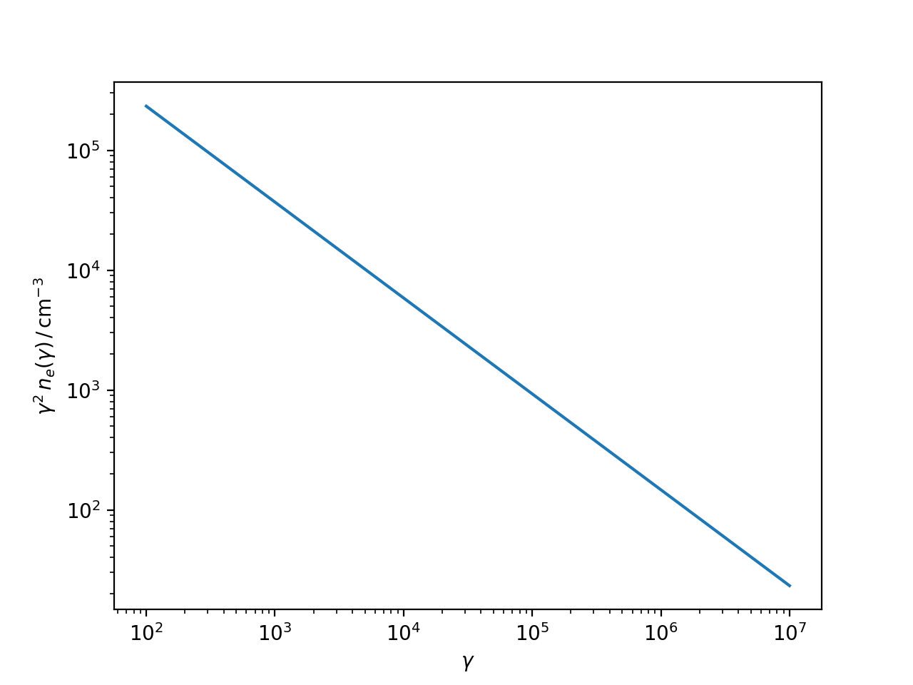

.. _emission_regions:

Emission Regions
================

At the moment the only emission region available in the code is a simple spherical plasmoid, commonly referred to as **blob** in the literature.
For more details on the electrons spectra you can read the :ref:`spectra` API.

Follows an example of how to initialise a `Blob` using `astropy` quantities:

.. code-block:: python

	import astropy.units as u
	from astropy.coordinates import Distance
	from agnpy.emission_regions import Blob

	# set the spectrum normalisation (total energy in electrons in this case)
	spectrum_norm = 1e48 * u.Unit("erg") 
	# define the spectral function through a dictionary
	spectrum_dict = {
	    "type": "PowerLaw", 
	    "parameters": {"p": 2.8, "gamma_min": 1e2, "gamma_max": 1e7}
	}
	R_b = 1e16 * u.cm
	B = 1 * u.G
	z = Distance(1e27, unit=u.cm).z
	delta_D = 10
	Gamma = 10
	blob = Blob(R_b, z, delta_D, Gamma, B, spectrum_norm, spectrum_dict)

The :class:`~agnpy.emission_regions.Blob` can be printed at any moment

.. code-block:: python

	print(blob)

returning a summary of its properties

.. code-block:: text

	* spherical emission region
	 - R_b (radius of the blob): 1.00e+16 cm
	 - V_b (volume of the blob): 4.19e+48 cm3
	 - z (source redshift): 0.07
	 - d_L (source luminosity distance):1.00e+27 cm
	 - delta_D (blob Doppler factor): 1.00e+01
	 - Gamma (blob Lorentz factor): 1.00e+01
	 - Beta (blob relativistic velocity): 9.95e-01
	 - mu_s (cosine of the jet viewing angle): 9.95e-01
	 - B (magnetic field tangled to the jet): 1.00e+00 G
	* electron spectrum
	 - power law
	 - k_e: 9.29e+06 1 / cm3
	 - p: 2.80
	 - gamma_min: 1.00e+02
	 - gamma_max: 1.00e+07

the electron distribution accelerated in the blob :math:`n_e` can be also visualised 
(multiplying it by an arbitrary power of gamma):

.. code-block:: python

	import matplotlib.pyplot as plt
	blob.plot_n_e(gamma_power=2)
	plt.show()

Normalisation modes
-------------------

By chosing a normalisation in units of :math:`{\rm cm}^{-3}` one can select - 
specifying the parameter `spectrum_norm_type` - three different modes of normalising 
the electron distribution.

  * `integral`: (default) the spectrum is set such that :math:`n_{e,\,tot}` equals the value provided by `spectrum_norm`;  

  * `differential`: the spectrum is set such that :math:`k_e` equals the value provided by `spectrum_norm`;    

  * `gamma=1`: the spectrum is set such that :math:`n_e(\gamma=1)` equals the value provided by `spectrum_norm`.

API
---

.. automodule:: agnpy.emission_regions
   :noindex:
   :members: Blob 