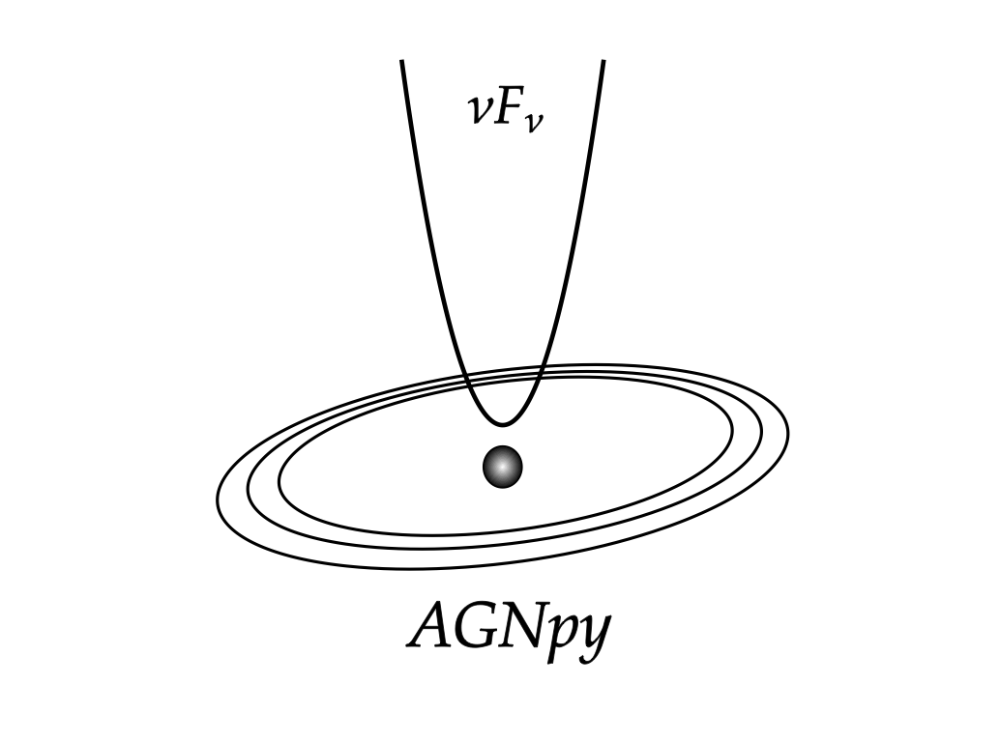

agnpy docs
=================================
`agnpy` focuses on the numerical computation of the photon spectra produced by leptonic radiative processes in jetted Active Galactic Nuclei (AGN).    

Description
-----------
References
..........
Notation and basic formulas are borrowed from [DermerMenon2009]_ which constitutes the fundamental reference for this code. The implementation of synchrotron and synchrotron self-Compton radiative processes relies on [DermerMenon2009]_ and [Finke2008]_; [Dermer2009]_ and [Finke2016]_ are instead the main references for the external Compton radiative processes.

Implementation
..............
The numerical operations are delegated to `numpy arrays <https://numpy.org>`_, all the physical quantities computed are casted as `astropy Quantities <https://docs.astropy.org/en/stable/units/>`_.

License
-------
The code is licensed under `GNU General Public License v3.0 <https://www.gnu.org/licenses/gpl-3.0.html>`_ (see `LICENSE.md` in the main directory).

Installation
------------
The code is available in the `python package index <https://pypi.org/project/agnpy/>`_ and can be installed via ``pip``

.. code-block:: bash

    pip install agnpy

The code can also be installed with ``conda``

.. code-block:: bash

    conda install -c conda-forge agnpy

Dependencies
------------
The only dependencies are:

* `numpy <https://numpy.org>`_ managing the numerical computation;

* `astropy <https://www.astropy.org>`_ managing physical units and astronomical distances.

* `matplotlib <https://matplotlib.org>`_ for visualisation and reproduction of the tutorials.

Overview
--------
The documentation includes several tutorial jupyter notebooks providing examples of applications of the code functionalities.

.. toctree::
   :maxdepth: 2

   spectra
   emission_regions
   synchrotron
   targets
   tutorials/energy_densities.ipynb
   compton
   tutorials/synchrotron_self_compton.ipynb
   tutorials/external_compton.ipynb
   absorption
   derivations
   spectral_constraints
   tutorials/ssc_sherpa_fit.ipynb
   tutorials/ec_dt_sherpa_fit.ipynb
   bibliography
   agnpy

