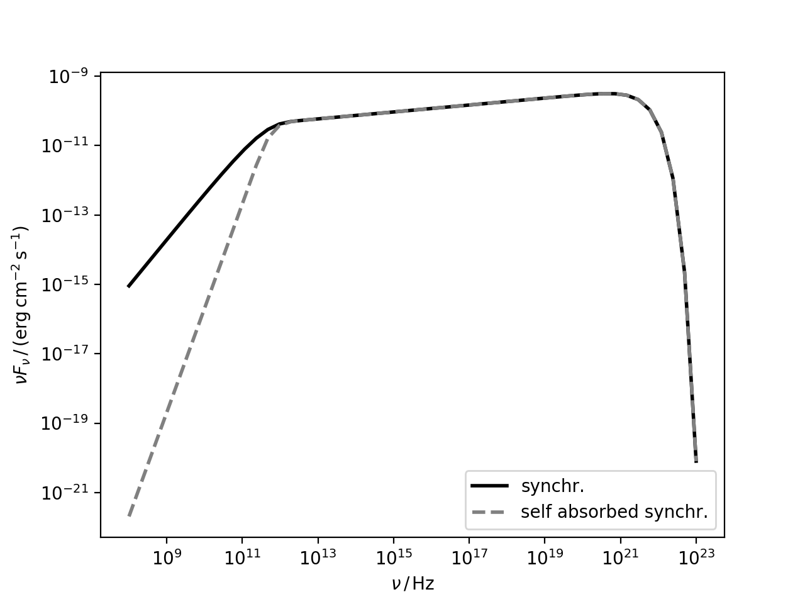

.. _synchrotron:

Synchrotron Radiation
=====================

The synchrotron radiation is computed following the approach of [DermerMenon2009]_ and [Finke2008]_.

Expanding the example in :ref:`emission_regions`, it is here illustrated how to produce a synchrotron spectral energy distribution (SED) staring from a :class:`~agnpy.emission_regions.Blob`. The Synchrotron Self Absorption (SSA) mechanism can be considered. 

.. code-block:: python

	import numpy as np
	import astropy.units as u
	from astropy.coordinates import Distance
	from agnpy.emission_regions import Blob
	from agnpy.synchrotron import Synchrotron
	import matplotlib.pyplot as plt

	# set the spectrum normalisation (total energy in electrons in this case)
	spectrum_norm = 1e48 * u.Unit("erg") 
	# define the spectral function through a dictionary
	spectrum_dict = {
		"type": "PowerLaw", 
		"parameters": {"p": 2.8, "gamma_min": 1e2, "gamma_max": 1e7}
	}
	R_b = 1e16 * u.cm
	B = 1 * u.G
	z = Distance(1e27, unit=u.cm).z
	delta_D = 10
	Gamma = 10
	blob = Blob(R_b, z, delta_D, Gamma, B, spectrum_norm, spectrum_dict)

to initialise the synchrotron radiation just pass the :class:`~agnpy.emission_regions.Blob` to the :class:`~agnpy.synchrotron.Synchrotron` class intialiser 

.. code-block:: python

	synch = Synchrotron(blob)
	# define a grid of frequency with astropy units and compute the synchrotron SED
	nu = np.logspace(8, 23) * u.Hz
	synch_sed = synch.sed_flux(nu)
	print(synch_sed)

this produces an array of :class:`~astropy.units.Quantity`

.. code-block:: text

	[9.07847459e-16 2.32031260e-15 5.92493131e-15 1.51066918e-14
 	3.84225947e-14 9.73302915e-14 2.44919517e-13 6.09602446e-13
 	1.49002539e-12 3.53274287e-12 7.95174302e-12 1.63760084e-11
 	2.91395183e-11 4.20896994e-11 4.96023122e-11 5.36546912e-11
 	5.75762828e-11 6.17811330e-11 6.62930673e-11 7.11345123e-11
 	7.63295326e-11 8.19039501e-11 8.78854724e-11 9.43038305e-11
 	1.01190926e-10 1.08580991e-10 1.16510753e-10 1.25019617e-10
 	1.34149851e-10 1.43946773e-10 1.54458910e-10 1.65738088e-10
 	1.77839278e-10 1.90819844e-10 2.04737198e-10 2.19642423e-10
 	2.35563710e-10 2.52464433e-10 2.70139425e-10 2.87965635e-10
 	3.04330867e-10 3.15437411e-10 3.13250483e-10 2.83748080e-10
 	2.11999976e-10 1.06769353e-10 2.42794688e-11 1.12784155e-12
 	2.22960447e-15 8.03665999e-21] erg / (cm2 s)
	
we can also plot the SED, showing for example the difference with a self-absorbed spectrum

.. code-block:: python

	synch_sed_SSA = synch.sed_flux(nu, SSA=True)
	plt.loglog(nu, synch_sed, color="k", lw=2, label="synchr.")
	plt.loglog(nu, synch_sed_SSA, lw=2, ls="--", color="gray", label="self absorbed synchr.")
	plt.xlabel(r"$\nu\,/\,\mathrm{Hz}$")
	plt.ylabel(r"$\nu F_{\nu}\,/\,(\mathrm{erg}\,\mathrm{cm}^{-2}\,\mathrm{s}^{-1})$")
	plt.legend()
	plt.show()

API
---

.. automodule:: agnpy.synchrotron
   :noindex:
   :members: Synchrotron 