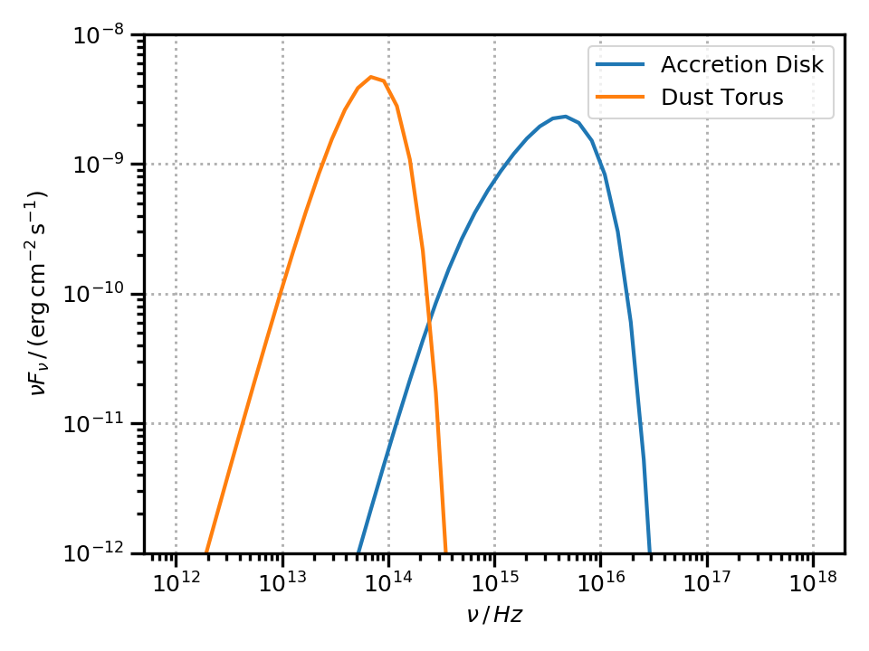

.. _targets:

Photon Targets for External Compton
===================================
The classes here described will provide the targets for the external Compton scattering.
They also allow, in the case of the accretion disk and dust torus, to compute their own black-body radiative emission.

The following objects are implemented:

* :class:`~agnpy.targets.CMB`, representing the Cosmic Microwave Background;

* :class:`~agnpy.targets.PointSourceBehindJet`, representing a monochromatic point source behind the jet. 
  This is mostly used to crosscheck that the energy densities and external Compton SEDs of the other targets reduce to
  this simplified case for large enough distances ([Dermer1994]_, [Dermer2002]_);

* :class:`~agnpy.targets.SSDisk`, representing a [Shakura1973]_ (i.e. a geometrically thin, optically thick) accretion disk;

* :class:`~agnpy.targets.SphericalShellBLR`, representing the broad line region (BLR) as an infinitesimally thin spherical shell, on the lines of [Finke2016]_;

* :class:`~agnpy.targets.RingDustTorus`, representing the dust torus (DT) as an infintesimally thin ring, see treatment of [Finke2016]_.

Shakura Sunyaev disk
--------------------
The accretion disk can be intialised specifying:

- the mass of the central Black Hole, :math:`M_{\mathrm{BH}}`; 
- the disk luminosity, :math:`L_{\mathrm{disk}}`;
- the efficiency to transform accreted matter to escaping radiant energy, :math:`\eta`;
- the inner and outer disk radii, :math:`R_{\mathrm{in}}` and :math:`R_{\mathrm{out}}`.

.. literalinclude:: snippets/targets_snippet.py
   :lines: 1-14

Alternatively the disk can be initialised specifying R_in and R_out in dimensionless units of gravitational radius, setting the
``R_g_units`` argument to ``True`` (``False`` by default).

.. literalinclude:: snippets/targets_snippet.py
   :lines: 16-18

.. code-block:: text

   * Shakura Sunyaev accretion disk:
    - M_BH (central black hole mass): 2.39e+42 g
    - L_disk (disk luminosity): 2.00e+46 erg / s
    - eta (accretion efficiency): 8.33e-02
    - dot(m) (mass accretion rate): 2.67e+26 g / s
    - R_in (disk inner radius): 1.06e+15 cm
    - R_out (disk inner radius): 3.54e+16 cm

Broad Line Region (BLR)
-----------------------
The BLR can be initialised specifying: 

- the luminosity of the disk whose radiation is being reprocessed, :math:`L_{\mathrm{disk}}`;
- the fraction of radiation reprocessed, :math:`\xi_{\mathrm{line}}`;
- the type of line emitted (for a complete list see the :py:meth:`~agnpy.targets.SphericalShellBLR.print_lines_list` function);
- the radius at which the line is emitted, :math:`R_{\mathrm{line}}`.

Let us continue from the previous snippet considering a BLR reprocessing the previous disk luminosity and re-emitting the :math:`\mathrm{Ly}\alpha` line:

.. literalinclude:: snippets/targets_snippet.py
   :lines: 21-28

.. code-block:: text

   * Spherical Shell Broad Line Region:
    - L_disk (accretion disk luminosity): 2.00e+46 erg / s
    - xi_line (fraction of the disk radiation reprocessed by the BLR): 2.40e-02
    - line (type of emitted line): Lyalpha, lambda = 1.22e-05 cm
    - R_line (radius of the BLR shell): 1.00e+17 cm

Dust Torus (DT)
---------------
The DT can be initialised specifying:

- the luminosity of the disk whose radiation is being reprocessed, :math:`L_{\mathrm{disk}}`;
- the fraction of radiation reprocessed, :math:`\xi_{\mathrm{dt}}`;
- the temperature at which the black-body radiation peaks, :math:`T_{\mathrm{dt}}`;
- the radius of the ring representing the torus, :math:`R_{\mathrm{dt}}`. The latter is optional and if not specified will be automatically set at the sublimation radius (Eq. 96 in [Finke2016]_).

Let us continue from the previous snippet considering a DT reprocessing the disk luminosity in the infrared (:math:`T_{\mathrm{dt}} = 1000 \, \mathrm{K}`):

.. literalinclude:: snippets/targets_snippet.py
   :lines: 31-38

.. code-block:: text

   * Ring Dust Torus:
    - L_disk (accretion disk luminosity): 2.00e+46 erg / s
    - xi_dt (fraction of the disk radiation reprocessed by the torus): 1.00e-01
    - T_dt (temperature of the dust torus): 1.00e+03 K
    - R_dt (radius of the torus): 1.57e+19 cm

Black-Body SEDs
---------------
The SEDs due to the black-body (BB) emission by the disk and the DT can be computed via the ``sed_flux`` method of the two classes.
A multi-temperature BB is considered for the disk and a simple single-temperature BB for the DT.
An array of frequencies over which to compute the SED and the redshift of the host galaxy have to be specified to the ``sed_flux`` function.

.. literalinclude:: snippets/targets_snippet.py
   :lines: 41-59

**NOTE:** the BB emission of the thermal components is mostly meant to check their flux levels against that of the
non-thermal ones. `In this notebook <tutorials/dt_thermal_emission.html>`_ we illustrate that the BB emission
of the DT might not be sufficiently accurate to reproduce its :math:`100 - 1\,{\mathrm{\mu m}}` SED. 

Energy densities
----------------
``agnpy`` allows also to compute the energy densities produced by the photon targets, 
check the `tutorial notebook on energy densities <tutorials/energy_densities.html>`_.
