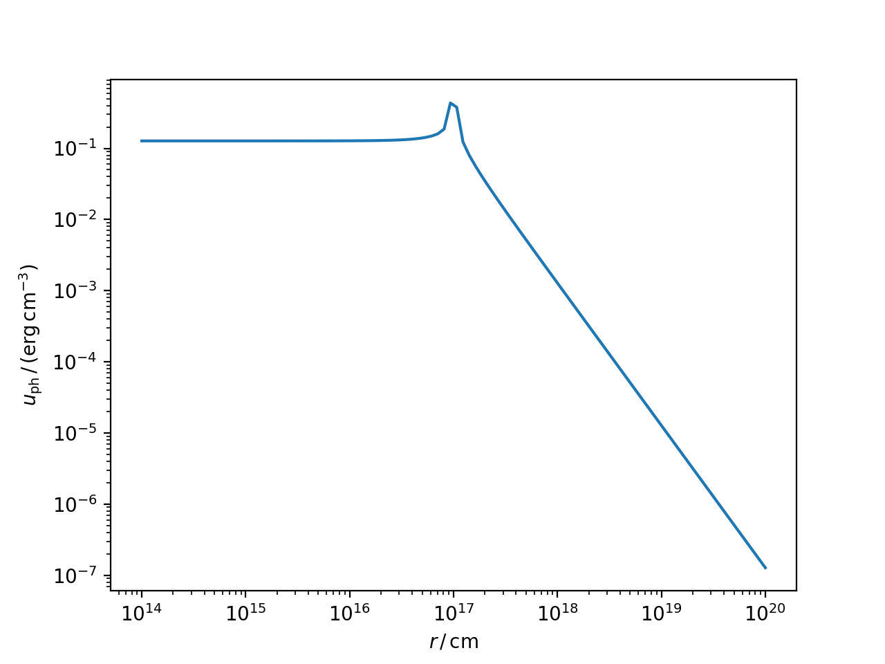

.. _targets:

Photon targets for External Compton
===================================
The classes here described will provide the targets for the external Compton scattering.
They also allow, in the case of the accretion disk and dust torus, to compute their own black-body radiative emission.

The following objects are implemented:

* :class:`~agnpy.targets.SSDisk`, representing a [Shakura1973]_ (i.e. a geometrically thin, optically thick) accretion disk;

* :class:`~agnpy.targets.SphericalShellBLR`, representing the Broad Line Region as an infinitesimally thin spherical shell, on the lines of [Finke2016]_;

* :class:`~agnpy.targets.SphericalShellBLR`, representing the Dust Torus as an infintesimally thin ring, see treatment of [Finke2016]_.

Shakura Sunyaev disk
--------------------
The accretion disk can be intialised specifying the mass of the central Black Hole, :math:`M_{\mathrm{BH}}`, the disk 
luminosity, :math:`L_{\mathrm{disk}}`, the efficiency to transform accreted matter to escaping radiant energy, :math:`\eta`,
the inner and outer disk radii, :math:`R_{\mathrm{in}}` and :math:`R_{\mathrm{out}}`.

.. code-block:: python

	import numpy as np
	import astropy.units as u
	import astropy.constants as const
	from agnpy.targets import SSDisk

	# quantities defining the disk 
	M_BH = 1.2 * 1e9 * const.M_sun
	L_disk = 2 * 1e46 * u.Unit("erg s-1")
	eta = 1 / 12
	R_g = 1.77 * 1e14 * u.cm
	R_in = 6 * R_g
	R_out = 200 * R_g

	disk = SSDisk(M_BH, L_disk, eta, R_in, R_out)

Alternatively the disk can be initialised specifying R_in and R_out in dimensionless units of gravitational radius, setting the
`R_g_units` argument to `True` (`False` by default).

.. code-block:: python
	
	disk = SSDisk(M_BH, L_disk, eta, 6, 200, R_g_units=True)

as for other `agnpy` objects, also the disk can be printed to display a summary of its values

.. code-block:: python
	
	print(disk)

.. code-block:: text

	* Shakura Sunyaev accretion disk:
	- M_BH (central black hole mass): 2.39e+42 g
	- L_disk (disk luminosity): 2.00e+46 erg / s
	- eta (accretion efficiency): 8.33e-02
	- dot(m) (mass accretion rate): 2.67e+26 g / s
	- R_in (disk inner radius): 1.06e+15 cm
	- R_out (disk inner radius): 3.54e+16 cm

Broad Line Region (BLR)
-----------------------
The BLR can be initialised specifying the luminosity of the disk whose radiation is being reprocessed, :math:`L_{\mathrm{disk}}`, 
the fraction of radiation reprocessed, :math:`\xi_{\mathrm{line}}`, the type of line emitted (for a complete list see the 
:func:`~agnpy.targets.print_lines_list`), the radius at which the line is emitted, :math:`R_{\mathrm{line}}`.
Let us continue from the previous snippet considering a BLR reprocessing the previous disk luminosity and re-emitting 
the :math:`\mathrm{Ly}\alpha` line:

.. code-block:: python

	from agnpy.targets import SphericalShellBLR                                                                                                                               

	# quantities defining the BLR
	xi_line = 0.024 
	R_line = 1e17 * u.cm                                                                                                                                                      

	blr = SphericalShellBLR(L_disk, xi_line, "Lyalpha", R_line)                                                                                                               

we can print a summary of the BLR properties via

.. code-block:: python

	print(blr)                                                                                                                                                                

.. code-block:: text

	* Spherical Shell Broad Line Region:
	- L_disk (accretion disk luminosity): 2.00e+46 erg / s
	- xi_line (fraction of the disk radiation reprocessed by the BLR): 2.40e-02
	- line (type of emitted line): Lyalpha, lambda = 0.00 cm
	- R_line (radius of the BLR shell): 1.00e+17 cm

Dust Torus (DT)
---------------
The DT can be initialised specifying the luminosity of the disk whose radiation is being reprocessed, :math:`L_{\mathrm{disk}}`, 
the fraction of radiation reprocessed, :math:`\xi_{\mathrm{dt}}`, the temperature where the black-body radiation peaks, 
:math:`T_{\mathrm{dt}}`, the radius of the ring representing the torus, :math:`R_{\mathrm{dt}}`. The latter is optional
and if not specified will be automatically set at the sublimation radius (Eq. 96 in [Finke2016]_).
Let us continue from the previous snippet considering a DT reprocessing the disk luminosity in the infrared 
(:math:`T_{\mathrm{dt}} = 1000 \, \mathrm{K}`):

.. code-block:: python

	from agnpy.targets import RingDustTorus                                                                                                                             

	# quantities defining the DT                            
	T_dt = 1e3 * u.K
	xi_dt = 0.1

	dt = RingDustTorus(L_disk, xi_dt, T_dt)

.. code-block:: python

	print(dt)                                                                                                                                                                

.. code-block:: text 

	* Ring Dust Torus:
	- L_disk (accretion disk luminosity): 2.00e+46 erg / s
	- xi_dt (fraction of the disk radiation reprocessed by the torus): 1.00e-01
	- T_dt (temperature of the dust torus): 1.00e+03 K
	- R_dt (radius of the torus): 1.57e+19 cm

Black-Body SEDs
---------------
The SEDs due to the black-body emission by the disk and the DT can be computed via the
`sed_flux` members of the two classes. An array of frequencies over which to compute the SEDs
and the redshift of the galaxy have to be specified.

.. code-block:: python

	import matplotlib.pyplot as plt
	# redshift of the host galaxy
	z = 0.1
	# array of frequencies to compute the SEDs
	nu = np.logspace(12, 18) * u.Hz
	# compute the SEDs
	disk_bb_sed = disk.sed_flux(nu, z)
	dt_bb_sed = dt.sed_flux(nu, z)
	# plot them
	plt.loglog(nu, disk_bb_sed, lw=2, label="Accretion Disk")
	plt.loglog(nu, dt_bb_sed, lw=2, label="Dust Torus")
	plt.xlabel(r"$\nu\,/\,\mathrm{Hz}$")
	plt.ylabel(r"$\nu F_{\nu}\,/\,(\mathrm{erg}\,\mathrm{cm}^{-2}\,\mathrm{s}^{-1})$")
	plt.ylim([1e-12, 1e-8])
	plt.legend()
	plt.show()

.. image:: _static/disk_torus_black_bodies.png
    :width: 500px
    :align: center

Radiation density
-----------------
In order to consider the density of target photons provided to the blob electrons for inverse Compton scattering,
it is possible to plot the denisty of radiation as a function of the coordinate along
the jet axis :math:`r`. As an example for the BLR:

.. code-block:: python
	
	r = np.logspace(14, 20, 100) * u.cm
	u_ph_blr = blr.u_ph(r)
	plt.loglog(r, u_ph_blr)
	plt.xlabel(r"$r\,/\,\mathrm{cm}$")
	plt.ylabel(r"$u_{\mathrm{ph}}\,/\,(\mathrm{erg}\,\mathrm{cm}^{-3})$")
	plt.show() 

API
---

.. automodule:: agnpy.targets
   :noindex:
   :members: SSDisk, SphericalShellBLR, RingDustTorus 