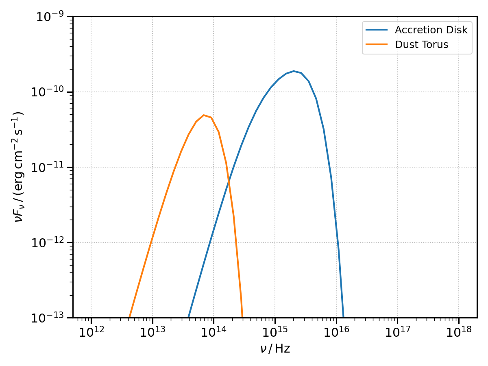

.. _targets:

Photon targets for External Compton
===================================
The classes here described will provide the targets for the external Compton scattering.
They also allow, in the case of the accretion disk and dust torus, to compute their own black-body radiative emission.

The following objects are implemented:

* :class:`~agnpy.targets.SSDisk`, representing a [Shakura1973]_ (i.e. a geometrically thin, optically thick) accretion disk;

* :class:`~agnpy.targets.SphericalShellBLR`, representing the Broad Line Region as an infinitesimally thin spherical shell, on the lines of [Finke2016]_;

* :class:`~agnpy.targets.SphericalShellBLR`, representing the Dust Torus as an infintesimally thin ring, see treatment of [Finke2016]_.

As physically both the Broad Line Region and the Dust Torus reprocess the radiation of the Disk, it is necessary to define a disk to intialise a BLR or Dust Torus object. Let us start defining an accretion disk around a Schwarzschild black hole of mass :math:`1.2 \times 10^9 \, M_{\odot}` (for an accretion disk around a Schwarzschild BH :math:`\eta=1/12`, :math:`R_{in} = 6 R_g`, where :math:`R_g` is the gravitational radius).

.. code-block:: python

	import numpy as np
	import astropy.units as u
	import astropy.constants as const
	from agnpy.targets import SSDisk, SphericalShellBLR, RingDustTorus
	import matplotlib.pyplot as plt

	# quantities defining the disk 
	M_BH = 1.2 * 1e9 * const.M_sun
	R_g = ((const.G * M_BH) / (const.c * const.c)).cgs
	L_disk = 2 * 1e46 * u.Unit("erg s-1")
	eta = 1 / 12
	R_in = 6 * R_g
	R_out = 200 * R_g

	disk = SSDisk(M_BH, L_disk, eta, R_in, R_out)

as for other `agnpy` objects, also the disk can be printed to display a summary of its values

.. code-block:: python
	
	print(disk)

.. code-block:: python
   
   * Shakura Sunyaev accretion disk:
 	- M_BH (central black hole mass): 2.39e+42 g
 	- L_disk (disk luminosity): 2.00e+46 erg / s
	- eta (accretion efficiency): 8.33e-02
 	- dot(m) (mass accretion rate): 2.67e+26 g / s
 	- R_in (disk inner radius): 1.06e+15 cm
 	- R_out (disk inner radius): 3.54e+16 cm
	

now let us define a Broad Line Region re-emitting the Lyman-alpha line (:math:`\nu_{\mathrm{line}}=2.47 \times 10^{15}\,\mathrm{Hz}`) and a dust torus reprocessing the disk radiation in the infrared (:math:`T \sim 1000\,\mathrm{K}`).

.. code-block:: python

	# quantities defining the Broad Line Region
	epsilon_line = 2e-5 # dimensionless energy of the Lyman alpha photons
	csi_line = 0.024
	R_line = 1e17 * u.cm
	# note the accretion disk is passed as a first argument
	blr = SphericalShellBLR(disk, csi_line, epsilon_line, R_line)

	# quantities defining the dust torus
	T_dt = 1e3 * u.K
	epsilon_dt = 2.7 * ((const.k_B * T_dt) / (const.m_e * const.c * const.c)).decompose()
	csi_dt = 0.1
	# again the disk is passed as a first argument
	dt = RingDustTorus(disk, csi_dt, epsilon_dt)

we can plot the Black Body SEDs produced by the accretion disk and the dust torus, let us assume we are observing a galaxy at :math:`z=0.1` with viewing angle w.r.t. the disk axis 5 deg.

.. code-block:: python

	z = 0.1
	mu_s = np.cos((5 * u.deg).to("rad"))
	# array of frequencies to compute the SEDs
	nu = np.logspace(12, 18) * u.Hz
	disk_bb_sed = disk.sed_flux(nu, z, mu_s)
	dt_bb_sed = dt.sed_flux(nu, z)
	# let us plot them
	plt.loglog(nu, disk_bb_sed, lw=2, label="Accretion Disk")
	plt.loglog(nu, dt_bb_sed, lw=2, label="Dust Torus")
	plt.xlabel(r"$\nu\,/\,\mathrm{Hz}$")
	plt.ylabel(r"$\nu F_{\nu}\,/\,(\mathrm{erg}\,\mathrm{cm}^{-2}\,\mathrm{s}^{-1})$")
	plt.ylim([1e-12, 1e-8])
	plt.legend()
	plt.show()

API
---

.. automodule:: agnpy.targets
   :noindex:
   :members: SSDisk, SphericalShellBLR, RingDustTorus 